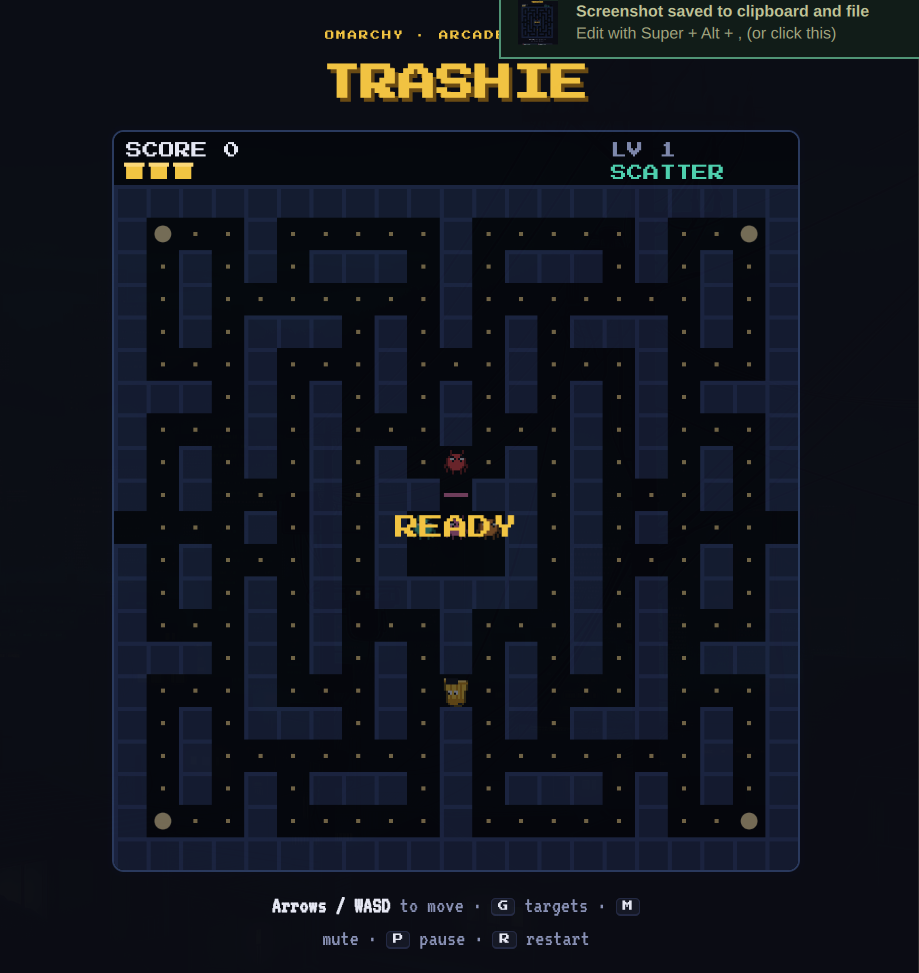

# Trashie

A Pac-Man-style arcade game for [Omarchy](https://omarchy.org). You are
**Trashie**, a walking trash can: clear the junk files out of the directory
maze while four virus **bugs** hunt you down. Grab a scan-shield pellet to turn
the tables and eat them.

The bar shows a small 🗑️ button. Click it and the game opens in its own
window; click it again and that window is focused instead of a new one opening.

By **bert** — [@AlbertDIII](https://x.com/AlbertDIII) on X.



## Install

```bash
omarchy plugin add https://github.com/Bert0424/omarchy-trashie.git
omarchy plugin enable bert.trashie
omarchy-restart-shell
```

Then add the **Trashie** widget to your bar from the Omarchy bar settings.

## Requirements

Stock Omarchy only: `omarchy-launch-webapp` (ships with Omarchy) and a
Chromium-family browser (Omarchy installs one by default). No other
dependencies, no build step.

## Remove

```bash
omarchy plugin disable bert.trashie
omarchy plugin remove bert.trashie
omarchy-restart-shell
```

Nothing else is left behind — no config is touched, no files are written.
If a game window is open, just close it.

## How to play

| Key | |
|---|---|
| Arrows / WASD | move |
| `G` | show each bug's target tile (debug view) |
| `M` | mute |
| `P` | pause |
| `R` | restart |

- **Dots** are +10, the pulsing **scan-shield** pellet is +50 and briefly makes
  the bugs edible (200 / 400 / 800 / 1600 for a chain).
- The four bugs each hunt differently — head-on, four tiles ahead, a pincer off
  the lead bug, and one that backs off when it gets close.
- Every level the bugs speed up, their scatter breaks get shorter, and the
  shield's effect shrinks — it's gone entirely by level 7.

## What it does to your system

- Adds one 🗑️ button to your Omarchy bar.
- Clicking it runs `scripts/launch.sh`, which opens the bundled file
  `game/index.html` as a chromeless web-app window using Omarchy's own
  `omarchy-launch-webapp` (your default supported browser, `--app` mode).
- `game/index.html` is self-contained. It makes **no network requests**, sends
  **no telemetry**, writes **no files**, and uses **no elevated privileges**.
  The two pixel fonts sit next to it in `game/fonts/` and load by relative path;
  the sound is synthesised in the browser with the Web Audio API.
- No background service, no state files, no PipeWire modules — nothing persists.
- Removing the plugin leaves nothing behind (see **Remove** above).

## Credits

Game, art, and audio by bert — [@AlbertDIII](https://x.com/AlbertDIII).
The four bugs (Hunter, Amber, Roger, Winston) chase using the classic
*Pac-Man Dossier* targeting rules. Not affiliated with Namco/Bandai — Trashie is
a package-manager parody, with its own maze, sprites, and names.

MIT licensed.
